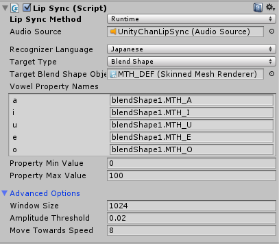
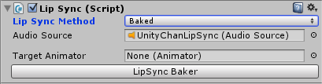
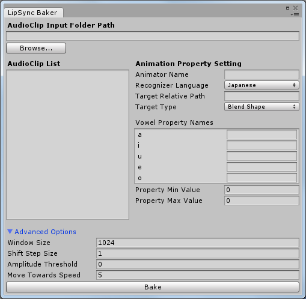
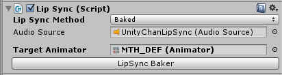

## LipSync是什么？

LipSync是一个基于Unity的独立、轻量化口型匹配解决方案。它可以帮助开发者在Unity上，用相对少的时间精力实现效果相对令人满意的“口型匹配”功能。LipSync可以运用已有的人物模型、口型动画以及语音资源，实现即时的口型匹配功能。你只需要告诉LipSync语音数据的来源、带有口型BlendShape的目标对象以及BlendShape属性名，并进行简单的设置，就能够让你的人物随着语音的播放动起他/她/它的嘴巴。

不过LipSync并不是万能的。为了能够愉快而有效地使用LipSync，你需要知道它目前做得到的事情有：

*	实时地分析语音数据，运用语音识别的一些理论，识别出某一时间帧中这段语音在日语或汉语 __元音__ 
*	事先分析好语音数据，把声学特征识别结果（也就是元音）作为资源文件存储在项目中，运行时直接读取这些数据
*	根据识别结果，生成动画权重数值，并把它们赋到目标对象上
*	让你的角色看起来真的像在说话一样

它目前做不到的事情有：
*	无中生有，在没有BlendShape的目标对象上实现口型匹配
*	识别出语音中的辅音
*	分析噪声过于严重的语音数据
*	分辨某一段声音是语音还是和语音不相关的其他声音

LipSync文件夹中的内容是本插件的主体部分，而UnityChan文件夹中的内容并不是本插件的一部分,是Unity Technology Japan为Unity开发的一个官方形象，它是为了演示LipSync的效果而附带的一套模型资源。

查看实现效果的展示视频， 点击[这里][i1], 笔者已经上传到B站。

## 使用LipSync前需要做什么准备？

LipSync需要你提供以下资源：

__1) 语音文件__

角色使用的语音文件。
为了保证语音识别方面的可靠性，语音中的噪音不能特别大。些许的噪音可以接受，LipSync一定程度上可以帮助剔除。
语音中也不能包含其他非语音的声音，例如背景音乐，环境音效等等。
除此之外没有其他的强制要求，只要是语音都可以使用。日语和汉语的语音可以得到最佳的匹配效果，其他语言的语音也可以使用。对于文件资源的摆放位置，有一个非强制的推荐性要求，即把每一个人的所有语音放置在各自的一个文件夹中。这有利于提高烘焙功能的使用效率。 如果你的开发工程是基于fmod环境的，步骤参见[install.md](install.md)

__2) 带有口型BlendShape的3D模型__

角色的3D模型，并且需要包括口型的BlendShape。至少每一个元音要对应一个BlendShape属性值，也就是说，在对应日语的情况下，你需要5个BlendShape属性值，对应汉语则需要6个。如果你的语音是这两种语言以外的，可以使用汉语元音的标准。如果你不知道BlendShape是什么，可以结合演示场景参考UnityChan的模型。

## 如何使用LipSync？

你需要找到你的模型上带有口型BlendShape的那个GameObject。它在Unity里表现为SkinnedMeshRenderer组件。以UnityChan模型为例。把这个GameObject赋予到LipSync的TargetBlendShape上。为了阐述方便，后文我们就把这个“带有口型BlendShape的那个GameObject”称之为“目标对象”。

这里先观察一下这个目标对象，展开BlendShapes项，可以看到它提供的BlendShapes属性值。这个UnityChan模型中提供的口型BlendShape的属性值即为：blendShapes1.MTH_A，blendShapes1.MTH_I，blendShapes1.MTH_U，blendShapes1.MTH_E，blendShapes1.MTH_O，对应的正好是日语中的5个元音。接下来就把这5个属性名一一对应地填到LipSync中的VowelPropertyNames当中。

 
   

最后可以进行一些设置。首先是BlendShape属性值共用的最小值和最大值，即PropertyMinValue和PropertyMaxValue，默认值是0和100，你可以根据实际情况进行调整。其次是一些进阶选项，可以看到相较图1，图5中的“Advanced Options”被展开了。
WindowSize的含义是窗口大小，它决定一次性从整个语音数据中截取多长的语音帧进行分析。它必须是2的幂。一般来说，512或1024是比较令人满意的取值，前者性能更加而识别精度稍差，后者则反之。低于512的情况下，虽然性能提升比较明显，但识别精度会变得很低；高于1024的情况下，性能会变得非常差，然而识别精度也不会提高很多。

AmplitudeThreshold的含义是能量阈值，它决定一个数据帧中所有值的总和要大于多少，才会被判断为一个有语音信息的帧。这一设计的作用是剔除无声帧，以减少不必要的识别操作。对于有少量噪音的语音，如果将这个值设得稍大一点，一定程度上就可以起到降噪的作用。
MoveTowardsSpeed的含义是平滑过渡的速度。语音帧与语音帧之间的识别结果，并不是直接就赋予到BlendShape属性值上的，而是经过了平滑过渡操作，实际赋予的属性值是经过插值的。从效果上看，这个速度越低，角色的嘴巴就动得越慢，给人的感觉是不太灵活；反之则越快，给人感觉移动非常夸张。一般来说，这个值可以取在6到10之间。

完成了这些设置值之后，尝试运行一下，你应该就可以看到UnityChan随着语音的播放动起了她的嘴巴。例子中，所识别的语音是日语，正如RecognizerLanguage所示的Japanese。如果你需要识别汉语，可以把RecognizerLanguage项切换成Chinese，此时VowelPropertyNames中会多出一个“v”的元音。除此之外没有其他变化。

以上介绍的都是在运行时即时地进行口型匹配。而在这一类动画相关的技术中，有一个很常用的处理方式——烘焙。以一定的灵活性为代价，把动画信息在开发阶段全部准备好，在运行时直接读取，这样便可在运行时省去所有的识别运算，从而大幅提高性能。LipSync也提供了这样的功能。

首先，先把LipSync组件中的LipSyncMethod切换为Baked，此时你会看到如图的内容。
 
   

点击LipSync Baker按钮，会出现如图所示界面。
 
   

你可以导入一个文件夹里的语音文件，并把它们的口型匹配数据烘焙到本地文件上。这里利用了Unity的动画系统，输出的文件就是AnimationClip与AnimatorController。
先从AudioClipInputFolderPath开始，这里点击“Browse...”按钮可以选择一个路径。当然，你只能选择位于Assets文件夹内的路径。之后，LipSync会搜索该文件夹内所有的音频文件，并记录到AudioClipList中。AnimatorName是烘焙完毕后，生成的Animator的名称。你可以自行进行指定。TargetRelativePath是为了应对特殊情况，一般来说生成的Animator会被挂载在目标对象上，但是可能会因为某些原因，导致只能挂载在它的某一个父级GameObject。这个TargetRelativePath就是用来指定相对路径用的。通常情况下不会用到它，这里我们选择不填写。

另外，AdvancedOptions里也多出了一项ShiftStepSize，这决定了采样时数据帧与数据帧之间的间隔。在实时匹配时，由于LipSync可以直接采样当前帧（渲染意义上）正在播放的声音片段，所以不需要这一个属性，而烘焙时声音并没有被真正播放，所以需要指定这个值。一般来说，取窗口长度的一半可以得到非常精确的结果，小于这个值的意义不大，烘焙时间却会增长。
全部设置完毕后，你可以点击“Bake”按钮。选择一个Assets文件夹内的路径，即可开始烘焙工作。烘焙工作需要的时间比较长，限于目前采用的计算方法，可能会长于语音文件本身的时间长度，请耐心等待一下。经过漫长的等待后，你可以在刚才指定的路径中找到烘焙结果。
然后，在目标对象上新建一个Animator组件，并把生成的AnimatorController赋予到上面。回到LipSync组件上，将目标对象赋予到TargetAnimator上。最后应该像下图这样。

     

尝试运行一下，你应该可以看到UnityChan的嘴巴又动了起来。至此，你应该已经会使用LipSync几乎所有的功能了。

## LipSync的原理是什么？

#### 1、从AudioSource或者AudioClip处获取语音数据

从AudioSource处获取是实时匹配时采用的方法。AudioSource本身提供了一个GetOutputData函数，可以获取当前正在播放的语音数据段。
从AudioClip处获取是烘焙是采用的方法。AudioClip本身其实是对语音文件的一个封装，可以使用GetData函数直接获得语音数据。
这过程中也包含了分帧与窗口化的步骤。

#### 2、剔除无声帧

从信号处理的角度上说，这一步是一种时域分析方法。对数据帧中的所有值进行求和，如果结果大于用户预设的一个阈值（也就是AmplitudeThreshold），那么就认为这一帧是没有声音的，不对它进行后续处理。这可以节省不必要的分析过程。如果适当调高阈值，一定程度上可以降噪。

#### 3、获取语音数据的频域信息

你在使用一些音乐播放器时，有时候会看到一根根跳动的长条，这就是“频谱”的一种表现方式，频域信息指的就是频谱。这对于语音识别来说是非常重要的信息。实时匹配时，AudioSource的GetSpecturmData函数带来了极大的帮助，这个函数本身可以高效地获取当前播放的语音数据频谱。

然而在烘焙时，并没有这样便利的函数可以用。所以，LipSync借助了一个数学工具——离散余弦变换（DCT），它可以用来获取一个时域信息段的频域信息。它与另一个著名的数学工具——傅里叶变换是等价的，所不同的是余弦变换只获取频率信息，而舍弃了相位信息。实际上这就够了，我们并不需要相位信息。这个数学工具的实现可以在MathToolBox.DiscreteCosineTransform中找到。

#### 4、提取共振峰

人在发声时，肺部收缩送出一股直流空气，经器官流至喉头声门处（即声带），使声带产生振动，并且具有一定的振动周期，从而带动原先的空气发生振动，这可以称为气流的激励过程。之后，空气经过声带以上的主声道部分（包括咽喉、口腔）以及鼻道（包括小舌、鼻腔），不同的发音会使声道的肌肉处在不同的部位，这形成了各种语音的不同音色，这可以称为气流在声道的冲激响应过程。

对于语音识别来说，重要的部分是第二个过程，因为“口型”就是声道形状的一部分。而这一冲激响应过程，在频谱上的表现为若干个凸起的包络峰。这些包络峰出现的频率，就被称为“共振峰频率”，简称为“共振峰”。
一般来说，通过求得一段语音数据的第一、第二共振峰，就可以非常精确地得知这段语音的“元音”是什么。只求第一共振峰，也可以知道大致结果。

LipSync的核心步骤正是如此。提取共振峰的方法是，在前一步骤中获取的频谱上求出局部最大值的最大值，具体实现在MathToolBox.FindLocalLargestPeaks中可以找到。

#### 5、把共振峰映射为元音特征值，进行平滑过渡处理，再赋予到目标对象上
后续步骤则比较容易理解，无非是一些映射操作与平滑过渡处理。平滑过渡的方法直接使用了Mathf.MoveTowards。

## 我想要改进LipSync，可以做些什么？

目前，有以下几个可以改进的方向：

#### 1、更优化的DCT算法

目前采用的DCT算法，是单线程直接计算了所有需要计算的值，时间复杂度为O(n^2)。这也是为什么烘焙的速度非常慢。一方面，可以考虑借鉴快速傅里叶变换所采用的算法（比如蝶形变换），把时间复杂度降到O(nlogn)；另一方面，可以考虑利用多线程计算。还可以考虑对余弦计算结果进行缓存。

#### 2、整体数学运算优化

这可以说是上一个问题的泛化版本。笔者在撰写数学函数时，几乎没有考虑步骤上的优化，所有步骤都很耿直地写上去了，所以应该有许多可以优化的地方。
另外，由于存在着各种浮点运算，对GPU的利用也是一个考虑方向。

#### 3、元音项的数据化，或者是更好的管理方法

如果你阅读过语音识别部分的代码，你可以看到所支持的两种语言的元音项都是写死的，显然这不太“优雅”。笔者的打算是把它们数据化，写到本地文件中，使用时动态进行读取，这既有利于管理，也有利于对更多的语言进行支持。
当然这不一定是最好的管理方法，如果你有什么高见，希望能够提出来。

#### 4、更加精确的语音识别方法

如果你对语音识别有一些研究，你应该知道，目前的语音识别方法中并没有去除基频的影响。如果基频的能量很高，会明显影响共振峰的识别。

[i1]: https://www.bilibili.com/video/BV1BK411578P
[i2]: http://unity-chan.com/