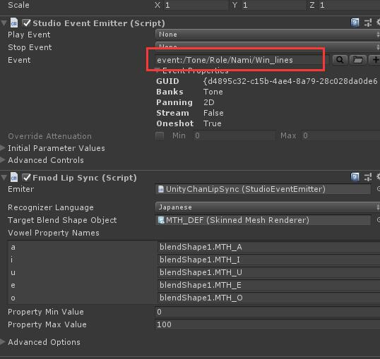

## FMOD LipSync

#### 1. Download fmod unitypackage

链接: https://pan.baidu.com/s/1dWuKDKMh1MDsnbN73h9xVw 提取码: 7z8v

#### 2. Import unitypackage to unity project

#### 3. Import fmod asset (.bank)

#### 4. Add macro in buildsettings

	macro: FMOD_LIVEUPDATE

  

#### 5. Open Scene named FmodScene
   
   path: Assets/LipSync/Demo/Scenes/FmodScene

#### 6. Config fmod events in FmodLipSync

  
    
#### 7. Start Game and run